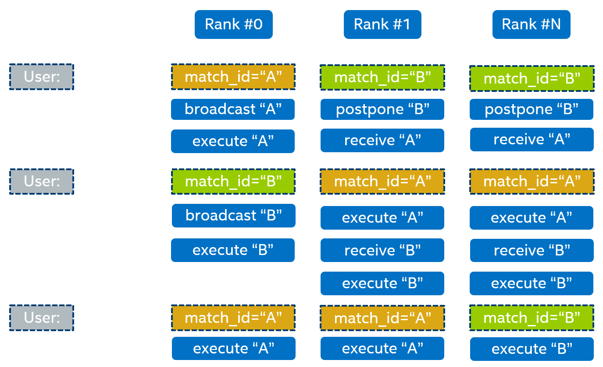

Out of Order Execution
**********************

Collective operations may be executed out of order on different nodes due to network or hardware-specific reasons.
In some implementations, such as out of order execution, a hang or data corruption may occur.

To prevent this, oneAPI CCL provides a mechanism to arrange collective operations execution in accordance with the user-defined identifier.
To set an identifier, use ``ccl_coll_attr_t``, where the ``match_id`` field is a pointer to a null-terminated C-style string.

Out of order execution is controlled by the zero-id rank. For example, the root rank.
When the root rank receives a user request with a non-empty ``match_id`` for the first time, 
it broadcasts information about the user identifier to all other ranks
and assigns an internal CCL identifier that will be used with all following operations with the same ``match_id``.

When a non-root rank receives a user request with a non-empty ``match_id`` for the first time, 
it postpones operation execution until it receives a message from the root rank. 
Once the message is received, the rank creates an internal CCL identifier
that will be used for all following operations with the same ``match_id``.

